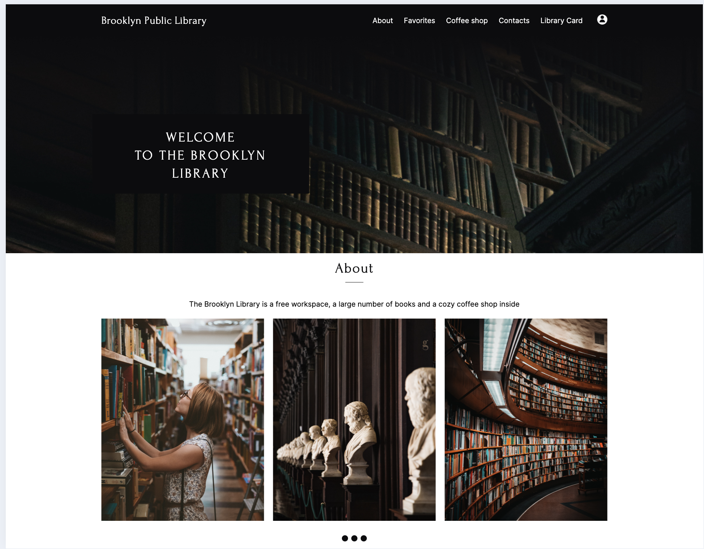
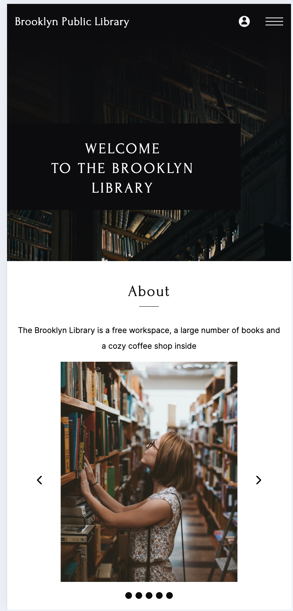

# Сайт библиотеки

Мой первый проект на чистом HTML и CSS.
Выполнен в рамках обучения на курсе front-end developer, RS-School

Технологии проекта: 
- HTML5,
- CSS3,
- Figma,
- PerfectPixel

Особенности проекта:
- адаптивная верстка,
- БЭМ

Скриншоты проекта:

